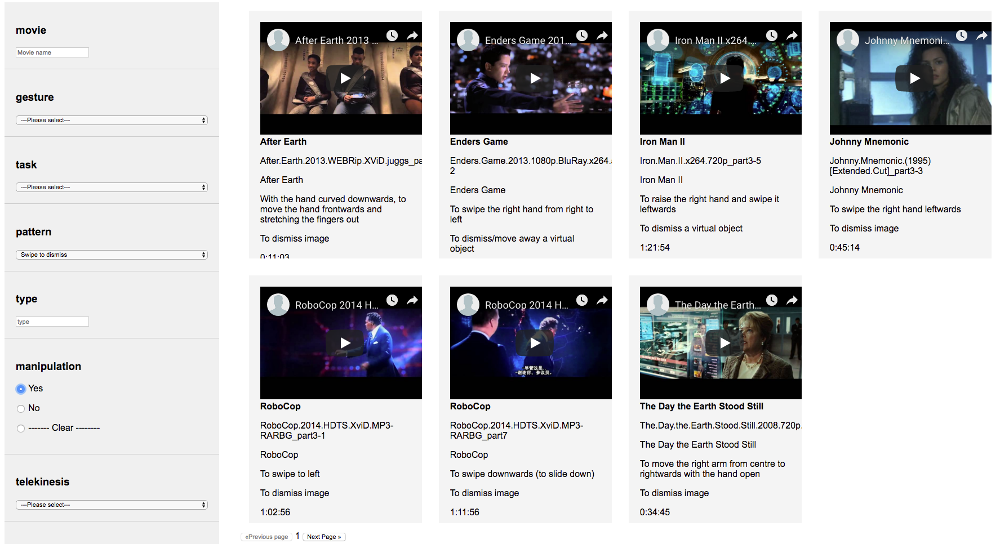

# Catalogs API
Import Google Spreadsheet data into your website with ease.




## Usage
### Configuring your webpage
1. Download and extract the contents of the **dist** folder into yor website directory.
2. Include the necessary files in the html
```
  <script src="https://cdnjs.cloudflare.com/ajax/libs/angular.js/1.4.5/angular.js"></script>
  <script src="https://cdnjs.cloudflare.com/ajax/libs/angular-filter/0.5.5/angular-filter.min.js"></script>
  <script src="https://cdnjs.cloudflare.com/ajax/libs/tabletop.js/1.4.2/tabletop.min.js"></script>

  <script src="../dist/spreadsheet.js"></script>
  <script src="../dist/config.js"></script>
```
3. Open the **config.js** file and change the spreadsheet id.

### Configuring your Spreadsheet
1. Open your spreadsheet and go to File > Publish on the web. Then make sure "Whole document" is checked and click the **Publish** button.
2. See the demo sheet (https://docs.google.com/spreadsheets/d/13SVee7vyZ1xoxhrQCosEn1QvQ-bhbn1zubZZWS-EkmI/edit#gid=2018434422) to see how to configure your columns.


## Examples
Check the `examples/` folder to see two sample apps using the Catalogs API:
1. `cards.html`: Simple cards with videos, images, and text.
2. `cards_with_filters.html`: Cards with videos, text, and filtering options.

### Development
Clone the repository, use node and bower to install the dependencies and then initialize grunt.

    $ git clone https://github.com/voxarlabs/catalogs-api.git
    $ cd catalogs-api
    $ npm install
    $ bower install
    $ grunt watch
